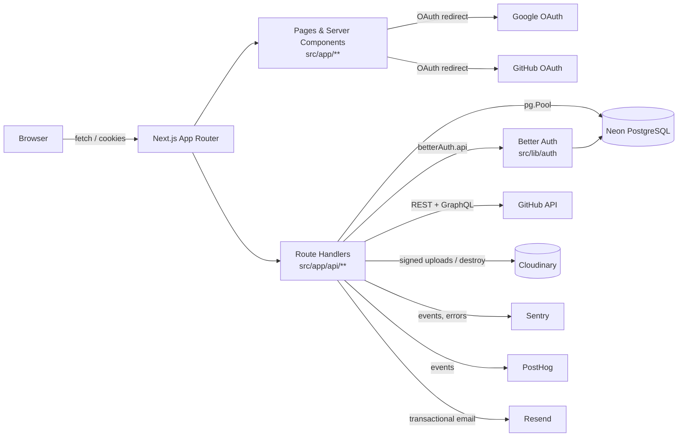

# Architecture

RateFactor is a Next.js 15 App Router application (`src/app`), configured for deployment on Vercel (hardcoded `https://ratefactor.vercel.app` trusted origin, `VERCEL_URL`/`VERCEL_PROJECT_PRODUCTION_URL` fallbacks in `src/lib/auth/better-auth.ts`), backed by Neon PostgreSQL, Cloudinary media storage, and GitHub/Google OAuth. There is a single server-side Postgres connection pool and no separate backend service — API route handlers under `src/app/api/**` are the entire server boundary.

## High-level flow

## Frontend / server boundary

- **Pages and UI**: `src/app/**` (route segments), `src/components/**` (shared UI), `src/features/**` (domain-organized feature modules: `auth`, `dashboard`, `notifications`, `portfolios`, each with its own `components/` and `hooks/`). Feature hooks (e.g. `src/features/portfolios/hooks/usePortfolios.ts`) call the JSON API with `fetch` — there is no server-action/RPC layer.
- **Server boundary**: every database write, every external API call bearing a secret (GitHub OAuth token, Cloudinary API secret, Resend API key), and all authorization checks live in `src/app/api/**` route handlers or the `src/lib/**` modules they import. No client component imports `pg`, `cloudinary`, or a GitHub OAuth token directly.
- **Middleware** (`src/middleware.ts`): edge-level route guard, matched only against `/dashboard/:path*` and `/profile/:path*`. It inspects cookies/headers for a plausible session token and redirects unauthenticated requests to `/`; it does not itself verify the session against the database (that happens in `getSessionUser` inside the route handler / server component).

## Authentication and identity

Better Auth (`src/lib/auth/better-auth.ts`) owns `user`/`session`/`account`/`verification` in Postgres and issues session cookies. RateFactor's own `profiles` table is a separate, richer application-identity table kept in sync by a database trigger rather than by application code, because Better Auth's user id is not always a UUID (it can be an email/password-flow-generated id) while every RateFactor foreign key expects a UUID `profiles.id`. `src/lib/auth/profile-id.ts#resolveCanonicalProfileId` reproduces that same deterministic mapping in TypeScript so route handlers can compute "this session's own profile id" without a database round trip when doing ownership checks (self-rating, self-like, delete-authorization). Full detail: [auth-and-identity.md](./auth-and-identity.md).

## Database access

All routes share the single `pool` exported from `src/lib/auth/better-auth.ts` (reused across Next.js HMR reloads in dev via a `globalThis` cache). Queries are hand-written parameterized SQL; there is no query builder or ORM. Every write path that affects a derived aggregate (rating averages, like/comment counts) either relies on a database trigger or explicitly re-reads the authoritative count/aggregate after the write, rather than trusting an in-memory increment — see [database.md](./database.md#triggers-and-functions) and [portfolio-system.md](./portfolio-system.md).

## GitHub integration

GitHub OAuth is one of Better Auth's configured `socialProviders`; the resulting `account` row (with `providerId = 'github'`) is the durable link between a RateFactor user and their GitHub identity. `src/lib/github/client.ts#getGithubAccessToken` reads that token server-side to make REST/GraphQL calls on the user's behalf. GitHub profile, repository, README, and contribution data is fetched live on every relevant request and cached only in a bounded, per-process in-memory cache (`src/lib/github/cache.ts`) — it is never written to Postgres. This is a deliberate scope decision: GitHub is treated as the live source of truth for that data, and only two things about GitHub are durable in RateFactor's own database: the OAuth linkage itself (Better Auth's `account` table) and per-portfolio verification metadata (`portfolios.github_verification_status/_login/_repository_full_name/_verified_at`), written once at submission time by `verifyGithubProjectRelationship`. Full detail: [github-integration.md](./github-integration.md).

## Media handling

Portfolio covers are either a Cloudinary-managed asset or an externally hosted http(s) image URL — never Postgres/base64-stored. For a Cloudinary-managed cover the flow is a signed-upload handshake (`POST /api/uploads/portfolio` returns a Cloudinary signature; the browser uploads directly to Cloudinary; the resulting public ID, version, and Cloudinary-issued signature are re-verified server-side before the portfolio row is persisted). This keeps the Cloudinary API secret server-side and keeps large binary payloads off the Next.js server and Postgres entirely. Full detail: [portfolio-system.md](./portfolio-system.md#media).

## Caching and egress

Two process-local, TTL-based caches sit in front of the two highest-traffic read endpoints:

- `src/lib/dynamic-portfolios.ts` — 45-second cache for the *default* public portfolio feed query (`GET /api/portfolios` with no filters, default sort, first page). A lightweight ETag is derived from a sample of portfolio ids/counts; requests with a matching `If-None-Match` get a `304` with zero response body. Any portfolio mutation (create, delete, like, rate, comment, comment-delete) calls `invalidatePortfoliosCache()`.
- `src/lib/developers-cache.ts` — 60-second cache for the default developer-directory query (`GET /api/developers`), same ETag/304 pattern, invalidated by portfolio creation/deletion and profile updates.

Both caches are **per server instance**, not a shared/distributed cache — on Vercel's serverless runtime this means each warm lambda instance has its own cache state, so the effective cache hit rate depends on instance reuse. Non-default queries (any filter, any sort other than `highest_rated`, any page beyond the first) bypass the L1 cache and query Postgres directly, with filtering, sorting, and pagination (`LIMIT`/`OFFSET`) resolved in SQL rather than in the application layer. Being authenticated does **not**, by itself, remove the *default* query from the L1 cache: `GET /api/portfolios` always resolves the caller's profile id and likes first (two small SQL lookups), but if the query is otherwise the default (no filters, `highest_rated`, offset 0, limit 20) and the L1 cache is fresh, the feed payload itself is still served from memory, with the authenticated caller's own `isLiked` flags merged in per-request. Authentication changes the response's `Cache-Control` (`private, no-cache` instead of `public, s-maxage=30, stale-while-revalidate=120`) and adds the personalization lookups — it does not categorically force a Postgres round trip for the feed itself. See [portfolio-system.md](./portfolio-system.md#reading-public-feed) for the exact code path.

GitHub read endpoints have their own separate cache (`src/lib/github/cache.ts`): a bounded (max 500 entries), LRU-eviction, per-key-TTL in-memory `Map`, keyed by `profile:`/`contributions:`/`repos:`/`readme:` prefixes plus the lowercased username. Authenticated (token-bearing) lookups always bypass this cache — see [github-integration.md](./github-integration.md#caching) for why a shared cache slot per authenticated call would leak between users.

## Observability

- **Sentry** (`@sentry/nextjs`, `sentry.server.config.ts`, `sentry.edge.config.ts`, `src/instrumentation.ts`): initialized for the Node and Edge runtimes; `withSentryConfig` wraps `next.config.ts`. Downtime incidents (`src/lib/uptime.ts#trackDowntimeIncident`) are also forwarded to Sentry as `captureMessage` calls for `critical`/`high` severity.
- **PostHog** (`src/lib/posthog.ts`): client-side init is skipped unless `NEXT_PUBLIC_POSTHOG_KEY` looks like a real project key (`phc_` prefix); server-side events post directly to PostHog's `/capture/` HTTP endpoint (no SDK) so they work in any runtime including Edge.
- **Health/uptime**: `GET /api/health` and `GET /api/monitoring/uptime` call `trackUptimeHeartbeat()`, which calls `checkSystemHealth()` (`src/lib/uptime.ts`). `POST /api/monitoring/uptime` does **not** call `checkSystemHealth()` — it only records a `downtime_incident` event or a custom heartbeat ping (PostHog/Sentry) from the request body and never runs the dependency check itself. `checkSystemHealth()` reports on three "dependencies": PostgreSQL (a real, lightweight `SELECT 1` against the shared `pg.Pool`, `down` if it throws, `degraded` if `DATABASE_URL` is unset — no credentials exposed in the response), Better Auth (checked by env-secret presence), and the showcase engine (always reports healthy). There is no Supabase dependency in the health report. See [deployment-operations.md](./deployment-operations.md#monitoring) for how to interpret this.
- **Resend** (`src/lib/email/sender.ts`): used only for OTP verification emails; falls back to a console-logged dev mock when `RESEND_API_KEY` is unset.

## API groups

| Path prefix | Purpose |
|---|---|
| `/api/auth/[...all]` | Better Auth's catch-all handler, plus RateFactor's own OTP request/verify sub-routes and sign-up/sign-in rate limiting. |
| `/api/profile` | Read/update the authenticated (or a named) developer profile, including tech-stack distribution and accolades. |
| `/api/developers` | Public developer directory search/listing. |
| `/api/portfolios` and nested routes | Portfolio CRUD, likes, ratings, comments, comment reports. |
| `/api/uploads/portfolio` | Cloudinary signed-upload issuance and abandoned-upload cleanup. |
| `/api/github/*` | GitHub profile/repositories/contributions/README/sync/project-verification. |
| `/api/notifications` | Per-user notification list and read-state updates. |
| `/api/health`, `/api/monitoring/uptime` | Health/uptime reporting for external monitors. |

Full route-by-route detail, including auth requirements and side effects: [api-reference.md](./api-reference.md).

## Major source paths

| Subsystem | Path |
|---|---|
| Route handlers | `src/app/api/**` |
| Auth | `src/lib/auth/**` (`better-auth.ts`, `profile-id.ts`, `server-session.ts`, `rbac.ts`, `otp.ts`, `otp-handlers.ts`, `email.ts`, `client.ts`) |
| GitHub | `src/lib/github/**` |
| Cloudinary | `src/lib/cloudinary.ts` |
| Portfolio in-memory caches/stores | `src/lib/dynamic-portfolios.ts`, `src/lib/developers-cache.ts`, `src/lib/comments-store.ts` |
| Validation/guardrails | `src/lib/validations/**`, `src/lib/guardrails.ts` |
| Rate limiting | `src/lib/rate-limit.ts` |
| Observability | `src/lib/uptime.ts`, `src/lib/posthog.ts`, `sentry.*.config.ts`, `src/instrumentation.ts` |
| Database schema | `database/neon/**` |
| Feature UI | `src/features/**` |
| Shared types | `src/types/**` |

## System invariants

Rules future contributors must preserve:

1. **Database access is server-only.** No `pg` import, GitHub OAuth token, or Cloudinary secret may reach client code. All of it stays inside `src/app/api/**` or `src/lib/**` modules that only those routes import.
2. **GitHub profile/repository/README/contribution data is never persisted to Postgres.** It is fetched live and cached only in-process (`src/lib/github/cache.ts`). Do not reintroduce `github_*` mirror tables (see [database.md](./database.md#removed-tables--must-not-return)).
3. **A portfolio cover is either a Cloudinary-managed asset or an externally hosted image URL — never base64 in Postgres.** `portfolios.thumbnail_url` stores a URL; when `thumbnail_public_id` is set, the cover is Cloudinary-managed and both fields must pass `isAllowedPortfolioThumbnail` (https-only, `res.cloudinary.com`, public id under the configured folder). When `thumbnail_public_id` is absent, `thumbnail_url` may be any non-`res.cloudinary.com` `http:`/`https:` URL — external thumbnails are a supported first-class case, not a fallback.
4. **Rating/like/comment aggregates are derived, not authored.** Route handlers must read back the trigger-maintained (or freshly recounted) value after a write rather than trusting a client-supplied or optimistically incremented number.
5. **Self-rating and self-like are resolved server-side from the authenticated session**, using `resolveCanonicalProfileId`, and fail closed (reject) if ownership cannot be determined — never fail open.
6. **Portfolio GitHub verification is re-derived at submission time from the caller's own linked token.** A client-supplied verification status or GitHub login is never trusted; the preview endpoint (`/api/github/verify-project`) is non-authoritative and re-checked by `POST /api/portfolios`.
7. **The default public feed cache must stay invalidated on every mutation** that changes what it would return (portfolio create/delete, like, rate, comment, comment delete) — see `invalidatePortfoliosCache()` call sites.
8. **`database/neon/schema.sql` is the single canonical schema.** Anything that changes it for an existing database goes through a new file in `database/neon/migrations/`, not by hand-editing a live database out of band.
