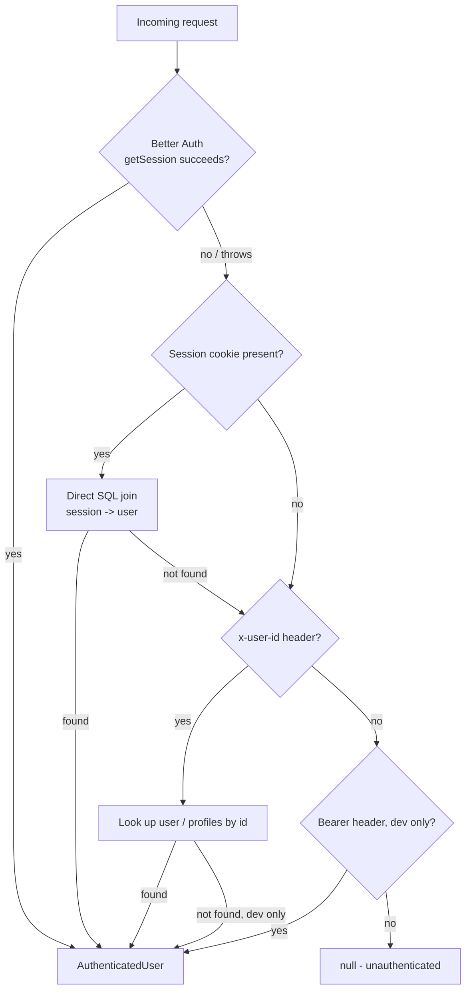
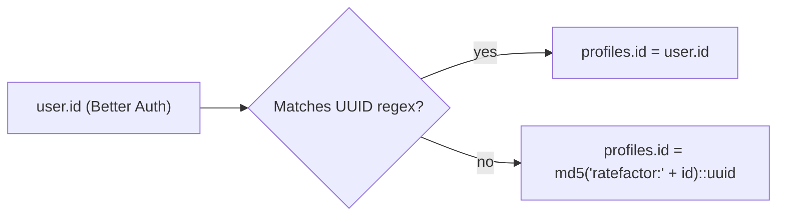

# Auth and identity

## Better Auth configuration

`src/lib/auth/better-auth.ts` constructs the server-side `auth` instance:

- **Database**: the shared `pool` (`pg.Pool`), reused across Next.js HMR reloads in development via a `globalThis` cache. SSL is enabled when the connection string looks like Supabase/pooled Postgres, contains `sslmode=require`, or the app is running in production off `localhost`; the `sslmode` query parameter is stripped from the connection string so `pg` doesn't fight with the explicit `ssl: { rejectUnauthorized: false }` option.
- **Secret**: `BETTER_AUTH_SECRET`, with a hardcoded development fallback (never used in production because the fallback is an obviously-labeled placeholder, not a silently-accepted empty value).
- **Base URL / trusted origins**: `baseURL` resolves from `BETTER_AUTH_URL` -> `NEXT_PUBLIC_APP_URL` -> Vercel's own `VERCEL_PROJECT_PRODUCTION_URL`/`VERCEL_URL` -> `http://localhost:3000`. `trustedOrigins` is a deduplicated set combining all of the above plus a hardcoded `https://ratefactor.vercel.app` and local dev origins. Vercel's preview-deployment URL variables are fallbacks only — an explicit `BETTER_AUTH_URL`/`NEXT_PUBLIC_APP_URL` should always be set in production so the canonical origin doesn't silently drift to whatever preview URL Vercel assigns.
- **Email/password**: enabled (`emailAndPassword: { enabled: true }`).
- **Social providers**: `github` and `google`, both reading client id/secret from env with placeholder fallback strings (so the app boots without OAuth configured, but sign-in with those providers will fail).
- **Plugins**: `@better-auth/infra`'s `dash` and `sentinel` plugins are **always** included in the `plugins` array regardless of `BETTER_AUTH_API_KEY` — `dash(apiKey ? { apiKey } : {})` / `sentinel(apiKey ? { apiKey } : {})`. Only the `apiKey` option passed *into* each plugin is conditional; without `BETTER_AUTH_API_KEY` set, both plugins still load, just with no `apiKey` in their config.
- **Additional user fields**: `role` (string, default `"user"`) and `onboarded` (boolean, default `false`) are added to Better Auth's own `user` table via `user.additionalFields`.

The client-side counterpart is `src/lib/auth/client.ts`, which creates a `better-auth/react` client pointed at `window.location.origin` in the browser (falling back to the same env vars server-side for SSR contexts), and exports `signIn`/`signUp`/`signOut`/`useSession`/`getSession`.

## Better Auth tables

`user`, `session`, `account`, and `verification` — full column reference in [database.md](./database.md#better-auth-tables). Session tokens are httpOnly cookies (`better-auth.session_token`, or `__Secure-...` in production); Better Auth also supports a database session lookup and a bearer-token header for API-style callers.

## Session resolution

`src/lib/auth/server-session.ts#getSessionUser` is the single function every route handler calls to resolve "who is making this request." It tries, in order:

1. **Better Auth's own session API** (`auth.api.getSession({ headers })`) — the normal path.
2. **Direct SQL session lookup**: if a `better-auth.session_token`/`session_token` cookie is present but step 1 threw (e.g. database temporarily unreachable in local dev), it extracts the raw token and joins `session` -> `user` directly, filtering on `"expiresAt" > NOW()`.
3. **`x-user-id` header**, verified against `public."user"` or, failing that, `public.profiles` by id or username. In non-production, an unverifiable `x-user-id` still returns a synthetic development user — this path is only reachable when `NODE_ENV !== "production"`.
4. **A bare `Authorization: Bearer ...` header** in non-production, returning a synthetic `bearer_user` — again gated to non-production.

The steps 3 and 4 development fallbacks exist so local/test requests can simulate a session without running Better Auth's full cookie flow; they are inert in production because of the explicit `NODE_ENV !== "production"` guards.

## Profile identity mapping

Better Auth's `user.id` is **not guaranteed to be a UUID** (its value depends on how the account was created), but every RateFactor application foreign key (`portfolios.author_id`, `ratings.user_id`, etc.) is typed `uuid` and points at `profiles.id`. Two independent, but *must-stay-identical*, implementations bridge this:

1. **Database trigger** `handle_better_auth_user_sync()` (fires `AFTER INSERT OR UPDATE OF name, image, role ON public."user"`): computes

   ```sql
   target_profile_id := CASE
     WHEN NEW.id ~* '^[0-9a-f]{8}-[0-9a-f]{4}-[0-9a-f]{4}-[0-9a-f]{4}-[0-9a-f]{12}$' THEN NEW.id::uuid
     ELSE md5('ratefactor:' || NEW.id)::uuid
   END;
   ```

   then upserts a matching `profiles` row (deriving a username from the email local-part, deduplicating on collision, and only ever *strengthening* role/onboarded — role is overwritten from `'user'` only, and `onboarded` only ever flips false -> true).

2. **Application code** `src/lib/auth/profile-id.ts#resolveCanonicalProfileId(betterAuthUserId)`: the identical UUID-passthrough-or-`md5('ratefactor:' || id)` computation, in TypeScript. Route handlers call this to compute the current session's own profile id **without a database round trip**, specifically for ownership checks that must fail closed (self-rating in `POST /api/portfolios/{id}/rate`, self-like in `POST /api/portfolios/{id}/like`, delete-authorization in `DELETE /api/portfolios/{id}`).

Both implementations must be changed together if the mapping algorithm ever changes — a mismatch would let `resolveCanonicalProfileId`'s ownership check silently disagree with the row the trigger actually created.

The comment-report route (`POST /api/portfolios/{id}/comments/{commentId}/report`) also calls `resolveCanonicalProfileId(authUser.id)` before inserting into `comment_reports.reporter_id` (a `uuid` FK to `profiles.id`), so a non-UUID Better Auth id is mapped to its canonical profile UUID rather than inserted raw. Full detail: [portfolio-system.md](./portfolio-system.md#reports).

Elsewhere (profile GET/PATCH, portfolio submission, comment/like/rating creation when *not* doing an ownership check), routes instead resolve the profile id by a **broader lookup**: `WHERE id::text = $authUserId OR LOWER(username) = LOWER($authUsername)`, or by the same `md5('ratefactor:' || id)::uuid OR id::text = id OR LOWER(username) = LOWER(username)` pattern inlined into SQL. This is intentionally more permissive than `resolveCanonicalProfileId` (it also matches on username) because those call sites are populating/reading data for "the current user," not proving non-ownership — the code comments in `rate/route.ts` and `like/route.ts` are explicit that username equality may only ever *strengthen* an "owner" conclusion, never substitute for it, and that an unresolved ownership check must reject the request (503) rather than assume the actor is not the owner.

## Roles

`src/lib/auth/rbac.ts` defines `AppRole` as an open string type covering a guest/user tier and a large set of discipline labels (`frontend`, `backend`, `qa`, `ml`, etc., all levels 1), plus `moderator` (2) and `admin` (3), via `ROLE_HIERARCHY`. `hasRole`/`isModerator`/`isAdmin` do case-insensitive lookups with an unknown non-guest role defaulting to level 1. `checkAdminAccess`/`checkModeratorAccess` return RFC 7807 `ProblemDetails` on failure. In practice, most content-authorization checks in route handlers compare `authUser.role === "moderator" || authUser.role === "admin"` inline (e.g. comment deletion) rather than calling these helpers directly.

`profiles.role` and `"user".role` are kept in sync by the same trigger/PATCH-route logic described above; there is no separate roles table.

## GitHub OAuth linkage

A successful GitHub sign-in/link produces an `account` row with `providerId = 'github'`, `userId` pointing at the Better Auth `user`, and `accessToken`/`refreshToken`/`scope` populated by Better Auth. `src/lib/github/client.ts#getGithubAccount`/`getGithubAccessToken` are the only functions that read this row, and they are called only from server-side code (`src/lib/github/*`, `src/app/api/github/*`). **OAuth tokens must never be returned in an API response or otherwise reach the browser** — every GitHub route handler that surfaces verification/sync results (`/api/github/sync`, `/api/github/verify-project`) explicitly returns only derived fields (username, status, repository name), never the token itself.

## Google OAuth

Configured identically to GitHub as a Better Auth `socialProviders` entry (`GOOGLE_CLIENT_ID`/`GOOGLE_CLIENT_SECRET`). No RateFactor feature currently reads a Google-specific token or API — it is used purely as an alternative sign-in method, producing the same `user`/`account`/`profiles` rows as any other provider.

## Email/password and OTP

Email/password sign-up goes through Better Auth directly. Additionally, RateFactor implements its own **one-time-passcode flow** independent of Better Auth's `verification` table:

- `src/lib/auth/otp.ts` — an in-memory `Map<challengeId, OTPChallenge>` (5-minute expiry, 5 max attempts, SHA-256-hashed codes, auto-cleanup via `setTimeout`). This is process-local state, not persisted to `auth_challenges` or any other table — a server restart or routing to a different instance invalidates in-flight challenges.
- `src/lib/auth/otp-handlers.ts` — `handleOtpRequest`/`handleOtpVerify`, invoked from `src/app/api/auth/[...all]/route.ts` for `.../otp/request` and `.../otp/verify` paths. Request creates a challenge and emails the code via `src/lib/email/sender.ts` (Resend, with a console-logged dev-mock fallback when `RESEND_API_KEY` is unset). Verify checks the hash/expiry/attempts and, for a signup purpose with a password, calls `auth.api.signUpEmail` server-side to actually create the Better Auth user.
- `src/lib/auth/email.ts` — canonicalizes email addresses (Gmail dot-trick and plus-addressing removal, `googlemail.com` -> `gmail.com` normalization, plus-addressing stripping for a wider provider list) and hashes the canonical form with SHA-256. This canonical hash is used in two independent places: (a) the sign-up dedup check in `src/app/api/auth/[...all]/route.ts` (`isCanonicalEmailRegistered`, backed by an in-memory `Set`, also process-local and reset on restart), and (b) as the identity key for the in-memory like/rating maps in the portfolio rate/like routes, so that Gmail-alias multi-accounting can't multiply a single person's rating/like influence.

Sign-in and sign-up are additionally sliding-window rate-limited (`SIGNIN_ATTEMPT`, `ACCOUNT_CREATION` presets in `src/lib/rate-limit.ts`) directly inside `src/app/api/auth/[...all]/route.ts`.

## Auth flow diagrams

### Session resolution



### Better Auth user -> profile id



## Related documentation

- [database.md](./database.md#better-auth-tables) — full column reference for `user`/`session`/`account`/`verification`/`profiles`.
- [github-integration.md](./github-integration.md) — how the `account` row's token is used for API calls.
- [api-reference.md](./api-reference.md) — auth requirements per route.
