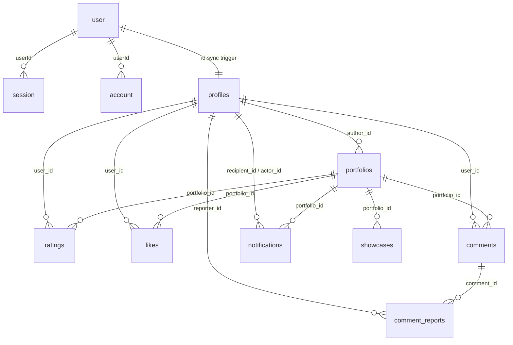

# Database

RateFactor's runtime database is Neon-hosted PostgreSQL 17, accessed through a single shared `pg.Pool` (`src/lib/auth/better-auth.ts`, exported as `pool`) that is reused by Better Auth and every application route handler. There is no ORM; all application queries are hand-written parameterized SQL.

## Canonical schema, migrations, and validation

Three files under `database/neon/` govern the schema, each with a distinct role:

| File | Role |
|---|---|
| `database/neon/schema.sql` | **Canonical schema.** Idempotent, fresh-database baseline. Source of truth for what a new Neon database should contain. |
| `database/neon/migrations/*.sql` | **Transition migrations.** Ordered, forward-only SQL to bring an *existing* database (one created before a given change) up to date. Currently: `20260915000000_add_portfolio_thumbnail_public_id.sql` (adds `portfolios.thumbnail_public_id` + its unique constraint), `20260916000000_drop_github_cache_tables.sql` (drops the five `github_*` mirror tables), and `20260916010000_add_portfolio_domains.sql` (adds `portfolios.domains text[] NOT NULL DEFAULT '{}'` + its GIN index). All changes are already folded into `schema.sql`, so a fresh database never needs to run them. |
| `database/neon/validation.sql` | **Read-only validation.** A sequence of `information_schema`/`pg_catalog` queries with expected counts in comments (e.g. "expect 14 tables"). Safe to run at any time against any environment; it never mutates data. Run it after applying schema or migration SQL to confirm the result matches what `schema.sql` defines. |

`database/neon/README.md` no longer exists as a separate document — this file is the maintained reference.

The schema was originally derived from a `pg_dump --schema-only` of the legacy Supabase database, with all Supabase-platform-only objects (RLS policies referencing `auth.uid()`, the `auth.users` FK on `auth_challenges`, Supabase event triggers, `pg_graphql`/`pg_cron`/`pg_net` grants, the `current_user_role`/`is_admin`/`is_moderator`/`handle_new_user` helper functions, and `tr_prevent_role_escalation`) stripped out. RLS is not enabled anywhere in this schema; access control is enforced entirely by triggers plus the API-layer ownership checks described in [auth-and-identity.md](./auth-and-identity.md) and [portfolio-system.md](./portfolio-system.md).

## Tables

There are 14 base tables in `public`: 4 owned by Better Auth, 10 owned by the RateFactor application.

### Better Auth tables

#### `user`

| Column | Type | Nullable | Default | Notes |
|---|---|---|---|---|
| id | text | NOT NULL (PK) | — | Better Auth's own user identifier (not necessarily a UUID). |
| name | text | NOT NULL | — | |
| email | text | NOT NULL (UNIQUE) | — | |
| emailVerified | boolean | NOT NULL | false | |
| image | text | nullable | — | |
| createdAt | timestamptz | NOT NULL | now | |
| updatedAt | timestamptz | NOT NULL | now | |
| role | text | NOT NULL | 'user' | Application-added field (`user.additionalFields.role` in `better-auth.ts`); source of `profiles.role` on sync. |
| banned | boolean | nullable | false | Better Auth moderation field; not read by application routes. |
| banReason | text | nullable | — | |
| banExpires | timestamptz | nullable | — | |
| lastActiveAt | timestamptz | nullable | — | |
| onboarded | boolean | NOT NULL | false | Application-added field; mirrors `profiles.onboarded`. |

#### `session`

| Column | Type | Nullable | Default | Notes |
|---|---|---|---|---|
| id | text | NOT NULL (PK) | — | |
| expiresAt | timestamptz | NOT NULL | — | |
| token | text | NOT NULL (UNIQUE) | — | Looked up directly by `getSessionUser`'s manual-SQL fallback. |
| createdAt / updatedAt | timestamptz | NOT NULL | now | |
| ipAddress / userAgent | text | nullable | — | |
| userId | text | NOT NULL (FK -> user.id, ON DELETE CASCADE) | — | |
| impersonatedBy | text | nullable | — | |

#### `account`

| Column | Type | Nullable | Default | Notes |
|---|---|---|---|---|
| id | text | NOT NULL (PK) | — | |
| accountId | text | NOT NULL | — | Provider-side account identifier. |
| providerId | text | NOT NULL | — | `"github"`, `"google"`, or Better Auth's email/password provider id. |
| userId | text | NOT NULL (FK -> user.id, ON DELETE CASCADE) | — | |
| accessToken / refreshToken / idToken | text | nullable | — | **Server-only.** Read by `src/lib/github/client.ts`; never returned to the browser. |
| accessTokenExpiresAt / refreshTokenExpiresAt | timestamptz | nullable | — | |
| scope | text | nullable | — | |
| password | text | nullable | — | Hashed credential for email/password sign-in. |
| createdAt / updatedAt | timestamptz | NOT NULL | now | |

A row with `providerId = 'github'` is the durable OAuth linkage that `src/lib/github/client.ts#getGithubAccount` reads to authorize every GitHub API call — see [auth-and-identity.md](./auth-and-identity.md) and [github-integration.md](./github-integration.md).

#### `verification`

| Column | Type | Nullable | Default | Notes |
|---|---|---|---|---|
| id | text | NOT NULL (PK) | — | |
| identifier | text | NOT NULL | — | |
| value | text | NOT NULL | — | |
| expiresAt | timestamptz | NOT NULL | — | |
| createdAt / updatedAt | timestamptz | NOT NULL | now | |

Used by Better Auth's own verification-token flows. RateFactor's own OTP challenge system (`src/lib/auth/otp.ts`) is a separate, in-memory mechanism and does not use this table (see [auth-and-identity.md](./auth-and-identity.md)).

### RateFactor application tables

#### `profiles`

| Column | Type | Nullable | Default | Notes |
|---|---|---|---|---|
| id | uuid | NOT NULL (PK) | gen_random_uuid() | Canonical application identity — see [auth-and-identity.md](./auth-and-identity.md#profile-identity-mapping). |
| username | text | NOT NULL (UNIQUE), 3–30 chars | — | Case-insensitively unique via `idx_profiles_lower_username`. |
| full_name | text | NOT NULL, 1–80 chars | — | |
| avatar_url | text | NOT NULL | Unsplash placeholder | |
| role | text | NOT NULL | 'user' | Free-text role/discipline (see `AppRole` in `src/lib/auth/rbac.ts`). |
| is_verified | boolean | NOT NULL | false | Profile-level badge, distinct from per-portfolio GitHub verification. |
| bio | text | nullable, <=500 chars | — | |
| status | jsonb | NOT NULL | `{"emoji":"⚡","message":"Building and shipping","statusType":"available"}` | |
| skills | text[] | NOT NULL | `{}` | |
| pinned_portfolio_ids | text[] | NOT NULL | `{}` | Dashboard "pins" feature. |
| spotlight_portfolio_id | text | nullable | — | |
| company / location | text | nullable, <=80 chars | — | |
| website / github / twitter / linkedin | text | nullable | — | |
| readme_markdown | text | nullable, <=10000 chars | — | Rendered on public profile pages. |
| created_at / updated_at | timestamptz | NOT NULL | now | `updated_at` maintained by `tr_profiles_updated_at`. |
| available_for_hire | boolean | NOT NULL | true | |
| custom_hire_message | text | nullable, <=500 chars | — | |
| onboarded | boolean | NOT NULL | false | |

#### `portfolios`

| Column | Type | Nullable | Default | Notes |
|---|---|---|---|---|
| id | text | NOT NULL (PK) | — | App-generated slug (`title-slug-<base36 timestamp>`), not a UUID. |
| author_id | uuid | NOT NULL (FK -> profiles.id, ON DELETE CASCADE) | — | |
| title | text | NOT NULL, 3–120 chars | — | |
| tagline | text | NOT NULL, 10–240 chars | — | |
| description | text | nullable, 1–2500 words if present | — | |
| portfolio_url | text | NOT NULL | — | |
| github_url | text | NOT NULL | — | Repository URL used for verification. |
| demo_url | text | nullable | — | |
| thumbnail_url | text | NOT NULL | — | A Cloudinary asset URL (when `thumbnail_public_id` is set) or an externally hosted `http://`/`https://` image URL (when it isn't) — both protocols are accepted for external URLs; only the Cloudinary case requires `https://res.cloudinary.com/...`. See `isAllowedPortfolioThumbnail` in [portfolio-system.md](./portfolio-system.md#creation). |
| thumbnail_public_id | text | nullable (UNIQUE) | — | Set only for Cloudinary-managed covers; see [portfolio-system.md](./portfolio-system.md#media). |
| image_size_bytes | integer | NOT NULL, 1–2097152 | — | Enforces the 2 MB cover limit at the database layer too. |
| category | portfolio_category (enum) | NOT NULL | — | |
| tech_stack | text[] | NOT NULL | `{}` | |
| domains | text[] | NOT NULL | `{}` | Portfolio Domains — the visual/interaction/technical experience (e.g. `Three.js`, `GSAP`), independent of `category` and `tech_stack`. Allowlist enforced at the application layer (`PORTFOLIO_DOMAINS` in `src/lib/portfolio-domains.ts`), 1–5 values on new submissions. Existing rows predating this column default to `{}` and are never inferred/backfilled. Filterable server-side via `GET /api/portfolios?domain=`, using `domains @> ARRAY[$1]`; see [api-reference.md](./api-reference.md) and [portfolio-system.md](./portfolio-system.md). |
| rating, rating_design, rating_code_quality, rating_performance, rating_documentation | numeric(3,2) | NOT NULL | 0.00 | Maintained exclusively by `sync_ratings()`; never written directly by route handlers. |
| rating_count | integer | NOT NULL, >=0 | 0 | |
| likes_count | integer | NOT NULL, >=0 | 0 | Maintained by `sync_likes_count()` and re-verified by the like route. |
| comments_count | integer | NOT NULL, >=0 | 0 | Maintained by `sync_comments_count()` and re-verified by the comment routes. |
| is_showcase | boolean | NOT NULL | false | Never set to true by any current API route (see [portfolio-system.md](./portfolio-system.md#showcase-column)). |
| showcase_type | text | nullable, 'daily'\|'weekly' | — | Unused by current write paths. |
| showcase_reason | text | nullable | — | Unused by current write paths. |
| status | content_status (enum) | NOT NULL | 'published' | Only `'published'` rows appear in the public feed query. |
| created_at / updated_at | timestamptz | NOT NULL | now | `updated_at` maintained by `tr_portfolios_updated_at` and bumped manually on like/comment count writes. |
| request_critique | boolean | NOT NULL | false | |
| github_verification_status | text | nullable, 'owner'\|'contributor'\|'none' | — | Durable per-portfolio GitHub verification result. |
| github_verified_login | text | nullable | — | |
| github_repository_full_name | text | nullable | — | |
| github_verified_at | timestamptz | nullable | — | |

#### `ratings`

| Column | Type | Nullable | Default | Notes |
|---|---|---|---|---|
| id | uuid | NOT NULL (PK) | uuid_generate_v4() | |
| portfolio_id | text | NOT NULL (FK -> portfolios.id, ON DELETE CASCADE) | — | |
| user_id | uuid | NOT NULL (FK -> profiles.id, ON DELETE CASCADE) | — | |
| score, design, code_quality, performance, documentation | numeric(3,2) | NOT NULL, 1.0–5.0 | — | `score` is the client-computed average of the four criteria. |
| created_at / updated_at | timestamptz | NOT NULL | now | |

`UNIQUE (portfolio_id, user_id)` enforces one rating per profile per portfolio (upserted via `ON CONFLICT`). The `tr_prevent_self_rating` trigger (`prevent_self_rating()`) raises a check-violation if `NEW.user_id` equals the portfolio's `author_id`, as a database-level backstop behind the API-layer self-rating check in `POST /api/portfolios/{id}/rate`.

#### `likes`

| Column | Type | Nullable | Default | Notes |
|---|---|---|---|---|
| id | uuid | NOT NULL (PK) | uuid_generate_v4() | |
| portfolio_id | text | NOT NULL (FK -> portfolios.id, ON DELETE CASCADE) | — | |
| user_id | uuid | NOT NULL (FK -> profiles.id, ON DELETE CASCADE) | — | |
| created_at | timestamptz | NOT NULL | now | |

`UNIQUE (portfolio_id, user_id)`. No equivalent self-like trigger exists at the database level — self-like prevention is enforced only in `POST /api/portfolios/{id}/like` (see [portfolio-system.md](./portfolio-system.md#likes)).

#### `comments`

| Column | Type | Nullable | Default | Notes |
|---|---|---|---|---|
| id | uuid | NOT NULL (PK) | uuid_generate_v4() | |
| portfolio_id | text | NOT NULL (FK -> portfolios.id, ON DELETE CASCADE) | — | |
| user_id | uuid | NOT NULL (FK -> profiles.id, ON DELETE CASCADE) | — | |
| content | text | NOT NULL, trimmed length 10–1500 | — | |
| status | text | NOT NULL, 'approved'\|'flagged'\|'hidden' | 'approved' | Auto-flagged by `sync_comment_reports()` at 3 reports. |
| is_reported | boolean | NOT NULL | false | |
| report_count | integer | NOT NULL, >=0 | 0 | |
| created_at / updated_at | timestamptz | NOT NULL | now | |
| critique_tag | text | nullable, one of 4 enum-like values | — | |

#### `comment_reports`

| Column | Type | Nullable | Default | Notes |
|---|---|---|---|---|
| id | uuid | NOT NULL (PK) | uuid_generate_v4() | |
| comment_id | uuid | NOT NULL (FK -> comments.id, ON DELETE CASCADE) | — | |
| reporter_id | uuid | NOT NULL (FK -> profiles.id, ON DELETE CASCADE) | — | |
| reason | report_reason (enum) | NOT NULL | — | |
| details | text | nullable, <=500 chars | — | |
| status | text | NOT NULL, 'pending'\|'reviewed'\|'dismissed' | 'pending' | Not currently updated by any route (no moderation UI ships yet). |
| created_at | timestamptz | NOT NULL | now | |

`UNIQUE (comment_id, reporter_id)`; a repeat report from the same reporter upserts `details`/`created_at` rather than duplicating.

#### `notifications`

| Column | Type | Nullable | Default | Notes |
|---|---|---|---|---|
| id | uuid | NOT NULL (PK) | uuid_generate_v4() | |
| recipient_id / actor_id | uuid | NOT NULL (FK -> profiles.id, ON DELETE CASCADE) | — | |
| portfolio_id | text | NOT NULL (FK -> portfolios.id, ON DELETE CASCADE) | — | |
| portfolio_title | text | NOT NULL | — | Denormalized snapshot at creation time. |
| type | text | NOT NULL, 'like'\|'rating'\|'comment'\|'showcase' | — | Only `'like'` and `'comment'` are currently produced by route handlers; `'rating'` and `'showcase'` are modeled but unused. |
| message | text | NOT NULL | — | |
| rating_score | numeric(3,2) | nullable | — | |
| is_read | boolean | NOT NULL | false | |
| created_at | timestamptz | NOT NULL | now | |

#### `showcases`

| Column | Type | Nullable | Default | Notes |
|---|---|---|---|---|
| id | uuid | NOT NULL (PK) | uuid_generate_v4() | |
| portfolio_id | text | NOT NULL (FK -> portfolios.id, ON DELETE CASCADE) | — | |
| showcase_type | text | NOT NULL, 'daily'\|'weekly' | — | |
| scores | jsonb | NOT NULL | — | |
| reason | text | NOT NULL | — | |
| created_at | timestamptz | NOT NULL | now | |

No current route handler inserts into this table; the showcase-selection logic in `src/lib/showcaseAlgorithm.ts` runs client-side over already-fetched portfolios and never persists a result. Retained as schema for a not-yet-wired feature — see [portfolio-system.md](./portfolio-system.md#showcase-column).

#### `auth_challenges` (legacy, unused by current code)

| Column | Type | Nullable | Default | Notes |
|---|---|---|---|---|
| id | uuid | NOT NULL (PK) | uuid_generate_v4() | |
| user_id | uuid | nullable | — | FK to `auth.users` was dropped (Supabase-only); column kept, no FK. |
| email | text | NOT NULL | — | |
| otp_hash | text | NOT NULL | — | |
| auth_provider | text | NOT NULL, 'google'\|'email_password' | — | |
| attempts | integer | NOT NULL | 0 | |
| max_attempts | integer | NOT NULL | 5 | |
| is_verified | boolean | NOT NULL | false | |
| expires_at | timestamptz | NOT NULL | — | |
| created_at | timestamptz | NOT NULL | now | |

RateFactor's live OTP flow (`src/lib/auth/otp.ts`, `src/app/api/auth/[...all]/route.ts`) uses an **in-memory** challenge map, not this table. The table is retained in the schema but is not queried by any current route.

#### `rate_limits` (legacy, unused by current code)

| Column | Type | Nullable | Default | Notes |
|---|---|---|---|---|
| key | text | NOT NULL (PK) | — | |
| points | integer | NOT NULL | 1 | |
| expire_at | timestamptz | NOT NULL | — | |

Rate limiting is implemented entirely in-process via `src/lib/rate-limit.ts`'s sliding-window `Map`, not through this table.

### Removed tables — must not return

Five transient GitHub mirror tables (`github_profiles`, `github_repositories`, `github_readmes`, `github_contributions`, `github_contribution_summaries`) previously existed and were dropped by `database/neon/migrations/20260916000000_drop_github_cache_tables.sql`. GitHub profile/repository/README/contribution data is fetched live from the GitHub API on every request and held only in the bounded process-local cache described in [github-integration.md](./github-integration.md) — it is never written back to PostgreSQL. Do not reintroduce these tables or any persistent GitHub data mirror; `validation.sql` §16 explicitly asserts they are absent.

## Relationships

Every application-table foreign key is `ON DELETE CASCADE`. Deleting a `profiles` row cascades through all of that user's portfolios, ratings, likes, comments, reports, and notifications; deleting a `portfolios` row cascades through its ratings, likes, comments, notifications, and showcase records (this is why `DELETE /api/portfolios/{id}` needs no manual child-table cleanup — see [portfolio-system.md](./portfolio-system.md#updates--deletion)). `user` -> `session`/`account` are Better Auth's own cascades. There is no direct foreign key from `profiles.id` to `"user".id`; the two are linked only by the deterministic id mapping described in [auth-and-identity.md](./auth-and-identity.md#profile-identity-mapping) and enforced by the sync trigger below.

## Triggers and functions

| Trigger | Table / Event | Function | Effect |
|---|---|---|---|
| `tr_on_better_auth_user_sync` | `user` AFTER INSERT/UPDATE OF name, image, role | `handle_better_auth_user_sync()` | Computes the deterministic profile UUID (UUID passthrough or `md5('ratefactor:' \|\| id)`), derives a username from the email local-part, and upserts the matching `profiles` row. Role is only overwritten from `'user'`; `onboarded` only ever moves false -> true. |
| `tr_prevent_self_rating` | `ratings` BEFORE INSERT/UPDATE | `prevent_self_rating()` | Raises `23514` if the rater's `user_id` equals the portfolio's `author_id`. |
| `tr_sync_ratings` | `ratings` AFTER INSERT/UPDATE/DELETE | `sync_ratings()` | Recomputes `portfolios.rating*` and `rating_count` as the `AVG`/`COUNT` over all rows for that portfolio. |
| `tr_sync_likes_count` | `likes` AFTER INSERT/DELETE | `sync_likes_count()` | Increments/decrements `portfolios.likes_count` (floored at 0). |
| `tr_sync_comments_count` | `comments` AFTER INSERT/DELETE | `sync_comments_count()` | Increments/decrements `portfolios.comments_count` (floored at 0). Note: this counts *all* comment rows regardless of `status`/`is_reported`, whereas route handlers separately recompute an "approved and not reported" count and write it back — see [portfolio-system.md](./portfolio-system.md#comments). |
| `tr_sync_comment_reports` | `comment_reports` AFTER INSERT | `sync_comment_reports()` | Increments `comments.report_count`, sets `is_reported = true`, and flips `status` to `'flagged'` once `report_count >= 3`. |
| `tr_*_updated_at` (profiles, portfolios) | BEFORE UPDATE | `set_updated_at()` | Sets `updated_at = NOW()`. |
| `tr_*_updated_at` (account, session, user, verification) | BEFORE UPDATE | `set_better_auth_updated_at()` | Sets `"updatedAt" = CURRENT_TIMESTAMP` (Better Auth's camelCase column convention). |

`tr_prevent_role_escalation` (a Supabase-only trigger calling `auth.uid()`) is intentionally **not** created in this schema — it would hard-error on Neon, which has no `auth` schema.

## Indexes

Beyond the primary/unique/FK-backing indexes, notable performance indexes include:

- Partial indexes scoped to `status = 'published'` for the public feed's three sort orders: `idx_portfolios_all_published_recent`, `_likes`, `_rating`, plus category-scoped variants (`idx_portfolios_published_feed`, `_likes`, `_recent`).
- `idx_portfolios_category_created` / `_likes` / `_rating` for authenticated/non-default queries that still filter by category.
- `idx_portfolios_domains` — a GIN index over `domains`, serving the array-containment filter (`domains @> ARRAY[$1]`) used by `GET /api/portfolios?domain=`.
- `idx_portfolios_search` — a GIN index over `to_tsvector('english', title || ' ' || tagline)` (not currently queried by `LIKE`-based search in `GET /api/portfolios`, which uses `ILIKE`/`LIKE` patterns instead of `to_tsvector`/`plainto_tsquery`).
- `idx_portfolios_author_created` — a covering index (`INCLUDE`) for author-scoped portfolio listing.
- `idx_ratings_portfolio_aggregate` — a covering index over the four rating criteria, supporting `sync_ratings()`'s `AVG` query without a heap fetch.
- Case-insensitive lookups: `idx_profiles_lower_username` (unique), `idx_profiles_lower_full_name`, `idx_user_lower_email`.
- Notification unread-count indexes: `idx_notifications_recipient_unread`, `idx_notifications_unread_recipient`.

## Migrations vs. fresh schema

`schema.sql` already contains `thumbnail_public_id`, `domains`, and excludes the `github_*` tables — a brand-new database only ever needs `schema.sql`. The `migrations/` directory exists purely to bring a database created *before* those changes forward; every migration file is idempotent (`ADD COLUMN IF NOT EXISTS`, `DROP TABLE IF EXISTS`, `CREATE INDEX IF NOT EXISTS`) and safe to re-run.

## Validation

`database/neon/validation.sql` is read-only and lists an expected count next to each check (14 tables, 4 enum types, 12 distinct triggers, 0 `github_*` tables, 0 Supabase platform schemas, 0 RLS policies, etc.). Run it after applying `schema.sql` or a migration to a target database — see [deployment-operations.md](./deployment-operations.md#database-verification) for when this is expected in the deployment flow.

## Related documentation

- [architecture.md](./architecture.md) — how route handlers use the shared pool.
- [auth-and-identity.md](./auth-and-identity.md) — the Better Auth user -> `profiles` id mapping in detail.
- [portfolio-system.md](./portfolio-system.md) — how the portfolio domain tables are read and written.
- [github-integration.md](./github-integration.md) — why GitHub data is not persisted here.
- [deployment-operations.md](./deployment-operations.md) — production database verification and the temporary Supabase rollback note.
