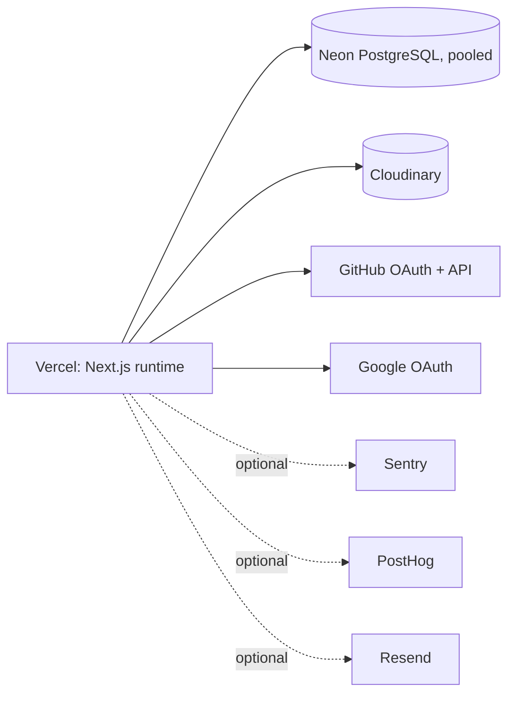

# Deployment and operations

## Production architecture

The repository is configured for deployment on Vercel — it is the intended/supported production target (`VERCEL_URL`/`VERCEL_PROJECT_PRODUCTION_URL` env-var fallbacks and a hardcoded `https://ratefactor.vercel.app` trusted origin in `src/lib/auth/better-auth.ts`), though this repository cannot itself confirm current live hosting state. Neon PostgreSQL is the runtime database (accessed via a pooled connection string through `pg.Pool` — see [architecture.md](./architecture.md#database-access)); Cloudinary stores portfolio cover images; GitHub and Google OAuth are configured through Better Auth; Sentry, PostHog, and Resend are optional integrations activated only when their credentials are present.

## Runtime environment variables

Categories, not values — see `.env.example` for the current variable list (unchanged by this documentation pass).

**Required at runtime:**
- `DATABASE_URL` — Neon pooled connection string.
- `BETTER_AUTH_SECRET` — Better Auth session/cookie signing secret.
- `BETTER_AUTH_URL` and/or `NEXT_PUBLIC_APP_URL` — canonical production origin. Set at least one explicitly; do not rely solely on Vercel's `VERCEL_URL`/`VERCEL_PROJECT_PRODUCTION_URL` fallbacks in `better-auth.ts`, since those track whatever URL Vercel assigns a given deployment rather than a fixed canonical domain.
- `CLOUDINARY_CLOUD_NAME`, `CLOUDINARY_API_KEY`, `CLOUDINARY_API_SECRET`, `CLOUDINARY_UPLOAD_FOLDER` — all four required together; `getCloudinaryConfig()` throws if any is missing. `POST /api/uploads/portfolio` (signature issuance) catches this and returns a clean `503`. `DELETE /api/uploads/portfolio` (cleanup) calls `getCloudinaryConfig()` outside any `try/catch`, so a missing-config environment surfaces there as an unhandled `500`, not a graceful `502`/`503` — see [portfolio-system.md](./portfolio-system.md#media). Note these variables are **not currently listed in `.env.example`** — see [development.md](./development.md#environment-setup).

**Optional integrations (feature degrades gracefully if unset):**
- `GITHUB_CLIENT_ID`/`GITHUB_CLIENT_SECRET`, `GOOGLE_CLIENT_ID`/`GOOGLE_CLIENT_SECRET` — OAuth sign-in for that provider; without them, Better Auth falls back to placeholder strings and that provider's sign-in will fail, but the app still boots.
- `NEXT_PUBLIC_SENTRY_DSN`/`SENTRY_DSN` — error tracking; a placeholder DSN is used if unset (effectively a no-op sink).
- `NEXT_PUBLIC_POSTHOG_KEY`/`NEXT_PUBLIC_POSTHOG_HOST`/`POSTHOG_API_KEY` — analytics/uptime telemetry; client init and server event dispatch are both silently skipped without a valid `phc_`-prefixed key.
- `RESEND_API_KEY`/`EMAIL_FROM` — OTP email delivery; without a key, OTP codes are logged to the server console instead of emailed (a **development-only** fallback that must not be relied on in production).
- `BETTER_AUTH_API_KEY` — the `@better-auth/infra` `dash`/`sentinel` plugins are always loaded; this variable only supplies the `apiKey` option passed into them. The app functions without it (both plugins load with an empty config).

**Migration/admin-only (never needed by the running application):**
- `SENTRY_AUTH_TOKEN`, `SENTRY_ORG`, `SENTRY_PROJECT` — build-time source-map upload configuration for `withSentryConfig`, not read by any request-handling code path.
- `NEXT_PUBLIC_SUPABASE_URL`, `NEXT_PUBLIC_SUPABASE_ANON_KEY`, `SUPABASE_SERVICE_ROLE_KEY` — legacy, retained in `.env.example` from before the Neon migration. **Not required by any current runtime code path** except the stale health-check debt noted under [Monitoring](#monitoring). See [Rollback](#rollback).

`NEXT_PUBLIC_*` variables are browser-visible; every other credential (database URL, Cloudinary secret, GitHub/Google OAuth secrets, Resend key, Better Auth secret) must remain server-only.

## Deployment flow

1. Push/merge to the branch Vercel builds from; Vercel runs `next build` (wrapped by `withSentryConfig`, which uploads source maps if `SENTRY_AUTH_TOKEN`/`SENTRY_ORG`/`SENTRY_PROJECT` are set).
2. Vercel serves the app against the configured `DATABASE_URL` — this should be Neon's **pooled** connection string (not the direct/unpooled one) given Vercel's serverless-per-request execution model, to avoid exhausting Postgres connection slots.
3. Cloudinary requires no build-time step; it's called at request time using the four `CLOUDINARY_*` variables.
4. Run the [production smoke-test checklist](#production-smoke-test-checklist) after every deploy that touches auth, portfolios, GitHub, or media.

## Production smoke-test checklist

- **Auth**: sign up (email/password and, if configured, GitHub/Google OAuth), sign in, sign out.
- **Session persistence**: reload the app after signing in; confirm the session survives a full page reload and a new tab.
- **Profiles**: view your own profile (`/api/profile`), edit and save a field via the dashboard, confirm it persists on reload.
- **Public developer feed**: `GET /api/developers` returns real profiles; pagination/search works.
- **Portfolio feed and pagination**: the public feed loads, category/host/search filters work, `offset`/`limit` paginate correctly, sort orders change the result order.
- **Ratings/likes/comments**: rate, like, and comment on a portfolio you don't own; confirm counts update and a self-rate/self-like attempt on your own portfolio is rejected.
- **Portfolio CRUD**: submit a new portfolio with a Cloudinary cover; confirm it appears in the feed; delete it and confirm it disappears and the Cloudinary asset cleanup is attempted (see [Database verification](#database-verification)).
- **Cloudinary upload/cleanup**: request a signed upload (`POST /api/uploads/portfolio`), upload directly to Cloudinary, submit the portfolio; separately, request a signed upload and abandon it, then call `DELETE /api/uploads/portfolio` and confirm the asset is removed.
- **GitHub OAuth/sync/repos/contributions/README/verification**: link a GitHub account, call `GET /api/github/sync`, confirm profile/repos/contributions/README all populate; submit a portfolio whose `githubUrl` you own and confirm `githubVerification.status === "owner"`.
- **Notifications**: trigger a like/comment on another account's portfolio and confirm the owner receives a notification; mark it read.
- **Health endpoints**: `GET /api/health` and `GET /api/monitoring/uptime` return `200` with `status: "healthy"` (or investigate any `degraded`/`down` dependency reported).

## Database verification

Run `database/neon/validation.sql` (read-only) against the production database after any schema/migration change, and compare its output to the expected counts in its comments — notably: 14 base tables, 0 `github_*` mirror tables, 0 Supabase platform schemas, 0 RLS policies, 4 enum types, 12 distinct triggers. See [database.md](./database.md#validation) for what each check means.

Also confirm operationally:
- New portfolio rows created via `POST /api/portfolios` with a Cloudinary cover have a non-null `thumbnail_public_id`, and the corresponding asset resolves at `https://res.cloudinary.com/{cloud_name}/image/upload/.../{public_id}.*`.
- Portfolio deletion removes the database row immediately; Cloudinary cleanup is best-effort and logged only on failure (`console.warn`) — periodically cross-check for Cloudinary assets under the configured upload folder that no `portfolios.thumbnail_public_id` references, and treat any as orphaned media from a failed cleanup.
- Better Auth tables (`user`, `session`, `account`, `verification`) are populated and the `handle_better_auth_user_sync` trigger is producing matching `profiles` rows for new users (spot-check via `validation.sql` §15 and a manual join).

## Monitoring

- **Sentry**: initialized for both the Node and Edge runtimes (`sentry.server.config.ts`, `sentry.edge.config.ts`, wired through `src/instrumentation.ts`); receives downtime-incident messages from `src/lib/uptime.ts` at `critical`/`high` severity.
- **PostHog**: receives an `uptime_heartbeat` event on every `/api/health` and `/api/monitoring/uptime` call, plus `downtime_incident` events when a dependency check fails.
- **Health endpoints**: `GET /api/health` and the heartbeat path of `GET /api/monitoring/uptime` call `checkSystemHealth()` in `src/lib/uptime.ts`. `POST /api/monitoring/uptime` (admin/moderator-gated incident reporting / custom heartbeat ping) does **not** call `checkSystemHealth()` — it only emits a PostHog/Sentry event built from the request body.
- **Known health-route debt**: `checkSystemHealth()` reports a `supabase` dependency, marked `degraded` whenever `NEXT_PUBLIC_SUPABASE_URL`/`NEXT_PUBLIC_SUPABASE_ANON_KEY` are unset. No code path in the application actually imports a Supabase client for request handling — this is monitoring debt left over from before the Neon migration, not evidence that Supabase is an active runtime dependency. A `degraded` Supabase entry in the health response should be ignored, not treated as an incident, until this check is removed or replaced with a real Neon connectivity check.

## Rollback

Supabase is retained **temporarily** as a historical rollback source while production validation of the Neon/Cloudinary migration remains open. Production must not write to Supabase under any circumstance during this window — it is not an active runtime dependency (see [Monitoring](#monitoring) above for the one stale exception, which reads env-var presence only and never connects). This section should be removed once the observation window closes and the responsible operator confirms Neon/Cloudinary recovery is no longer needed as a fallback; at that point Supabase can be decommissioned. Do not treat this as a migration roadmap or checklist — it exists solely to record the current temporary state.

## Related documentation

- [database.md](./database.md) — schema, migrations, and validation in full detail.
- [architecture.md](./architecture.md#observability) — Sentry/PostHog/Resend wiring.
- [portfolio-system.md](./portfolio-system.md#media) — Cloudinary upload/cleanup mechanics.
- [github-integration.md](./github-integration.md) — GitHub OAuth and API behavior in production.
